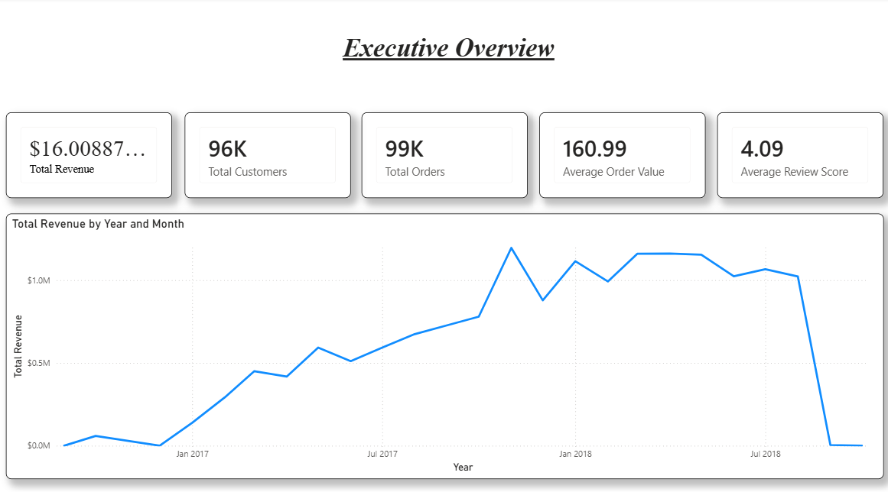
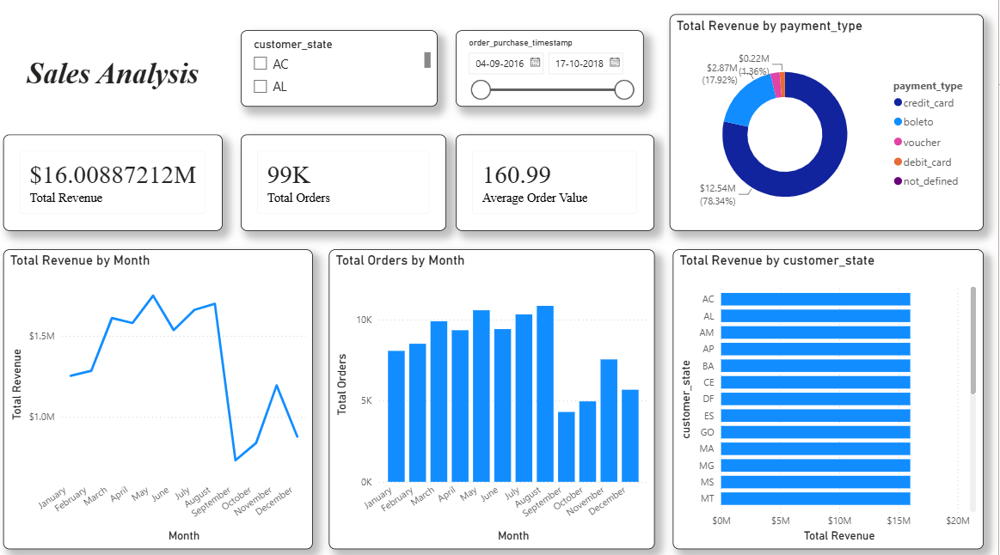
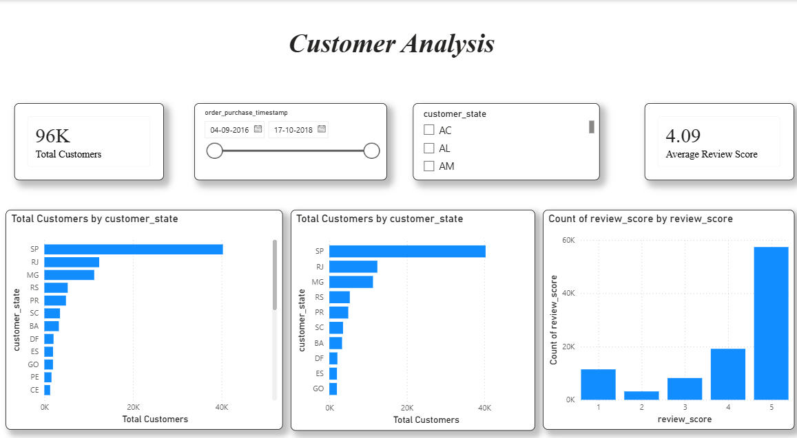

# 📦 Retail Supply Chain Intelligence Platform

A complete end-to-end **Retail Supply Chain Analytics** project that transforms raw e-commerce data into meaningful business insights using **Python, MySQL, SQL, and Power BI**.

The project demonstrates the complete analytics lifecycle—from data preprocessing and database design to business analysis and interactive dashboard development. It is designed to simulate a real-world Business Intelligence solution that enables organizations to monitor sales performance, customer behavior, payment trends, and operational efficiency.

---

# 📑 Table of Contents

- [Project Overview](#project-overview)
- [Objectives](#objectives)
- [Tech Stack](#tech-stack)
- [Project Structure](#project-structure)
- [Dataset](#dataset)
- [Data Processing Workflow](#data-processing-workflow)
- [Database Design](#database-design)
- [SQL Business Analysis](#sql-business-analysis)
- [Power BI Dashboard](#power-bi-dashboard)
- [Dashboard Screenshots](#dashboard-screenshots)
- [Business Insights](#business-insights)
- [How to Run the Project](#how-to-run-the-project)
- [Key Skills Demonstrated](#key-skills-demonstrated)
- [Future Enhancements](#future-enhancements)
- [Learning Outcomes](#learning-outcomes)
- [Author](#author)

---

# Project Overview

Retail organizations generate massive amounts of transactional data every day. Extracting meaningful insights from this data is essential for improving business performance, customer satisfaction, and operational efficiency.

This project builds a complete analytics pipeline that transforms raw retail data into interactive dashboards and business insights through systematic data processing, database management, SQL analysis, and visualization.

The project follows an end-to-end Business Intelligence workflow widely used in the retail industry.

---

# Objectives

- Clean and preprocess raw retail datasets using Python.
- Design a relational database using MySQL.
- Perform business analysis through SQL queries.
- Build interactive Power BI dashboards.
- Generate actionable business insights.
- Demonstrate an end-to-end Business Intelligence workflow.

---

# Tech Stack

| Technology | Purpose |
|------------|---------|
| Python | Data Cleaning & Preprocessing |
| Pandas | Data Transformation |
| MySQL | Relational Database |
| SQL | Business Analysis |
| Power BI | Dashboard Development |
| Git | Version Control |
| GitHub | Project Hosting |

---

# Project Structure

```text
Retail Supply Chain Intelligence Platform
│
├── dashboards
│   └── Retail_Supply_Chain.pbix
│
├── data
│   ├── raw
│   │   ├── olist_customers_dataset.csv
│   │   ├── olist_orders_dataset.csv
│   │   ├── olist_order_items_dataset.csv
│   │   ├── olist_order_payments_dataset.csv
│   │   ├── olist_order_reviews_dataset.csv
│   │   ├── olist_products_dataset.csv
│   │   ├── olist_sellers_dataset.csv
│   │   └── product_category_name_translation.csv
│   │
│   └── processed
│       ├── customers_clean.csv
│       ├── orders_clean.csv
│       ├── order_items_clean.csv
│       ├── payments_clean.csv
│       └── reviews_clean.csv
│
├── images
│   ├── executive_overview.png
│   ├── sales_analysis.png
│   └── customer_analysis.png
│
├── notebooks
│   └── 01_data_cleaning.ipynb
│
├── scripts
│   └── load_to_mysql.py
│
├── sql
│   ├── create_database.sql
│   ├── create_tables.sql
│   └── business_queries.sql
│
├── dashboards
│   └── Retail_Supply_Chain.pbix
│
├── .env
├── .gitignore
└── README.md
```

---

# Dataset

The project is built using the **Olist Brazilian E-Commerce Public Dataset**, which contains transactional data from a large Brazilian online marketplace.

The dataset includes:

- Customer Information
- Orders
- Order Items
- Payments
- Customer Reviews
- Products *(raw dataset)*
- Sellers *(raw dataset)*

Only the datasets required for analysis were cleaned and processed for dashboard development.

---

# Data Processing Workflow

```text
Raw CSV Files
       │
       ▼
Python Data Cleaning
       │
       ▼
Processed CSV Files
       │
       ▼
MySQL Database
       │
       ▼
SQL Business Analysis
       │
       ▼
Power BI Dashboard
```

---

# Database Design

The relational database consists of the following tables:

- customers_clean
- orders_clean
- order_items_clean
- payments_clean
- reviews_clean

Relationships were established using primary and foreign keys to support efficient querying and dashboard reporting.

---

# SQL Business Analysis

The project answers several real-world business questions using SQL.

### Revenue Analysis

- Total Revenue
- Monthly Revenue Trend
- Revenue by State

### Customer Analysis

- Total Customers
- Customer Distribution
- Customer Location Analysis

### Order Analysis

- Total Orders
- Order Status Distribution
- Monthly Order Trends

### Payment Analysis

- Payment Method Distribution
- Installment Analysis
- Average Order Value

### Review Analysis

- Average Review Score
- Customer Rating Distribution

---

# Power BI Dashboard

The Power BI report contains **three interactive dashboard pages** designed for business decision-making.

### Executive Overview

- Total Revenue
- Total Orders
- Total Customers
- Average Order Value
- Average Review Score
- Monthly Revenue Trend

### Sales Analysis

- Revenue Trend
- Monthly Orders
- Revenue by Payment Type
- Revenue by State
- Interactive Filters

### Customer Analysis

- Customer Distribution by State
- Top Customer Cities
- Customer Review Distribution
- Customer KPIs
  
---

# Dashboard Screenshots

## Executive Overview



---

## Sales Analysis



---

## Customer Analysis



---

# Business Insights

The analysis generated the following business insights:

- Identified monthly revenue trends to monitor sales performance.
- Analyzed customer distribution across different states.
- Evaluated customer payment preferences using payment methods.
- Measured customer satisfaction through review score analysis.
- Built KPI dashboards for quick business performance monitoring.

  
---

# How to Run the Project

## 1. Clone the Repository

```bash
git clone https://github.com/Varadhuu/Retail-Supply-Chain-Intelligence-Platform.git
```

---

## 2. Navigate to the Project Directory

```bash
cd Retail-Supply-Chain-Intelligence-Platform
```

---

## 3. Install Required Packages

```bash
pip install pandas sqlalchemy pymysql python-dotenv
```

---

## 4. Run Data Cleaning

Open and execute:

```text
notebooks/01_data_cleaning.ipynb
```

This generates the cleaned datasets inside:

```text
data/processed/
```

---

## 5. Create the Database

Execute the SQL files in the following order:

```text
sql/create_database.sql
sql/create_tables.sql
```

---

## 6. Load Data into MySQL

Run:

```bash
python scripts/load_to_mysql.py
```

---

## 7. Execute Business Queries

Run:

```text
sql/business_queries.sql
```

---

## 8. Open the Dashboard

Open the Power BI dashboard:

```text
dashboards/Retail_Supply_Chain.pbix
```

---

# Key Skills Demonstrated

- Data Cleaning
- Data Preprocessing
- Relational Database Design
- SQL Query Optimization
- Business Analytics
- KPI Development
- Dashboard Design
- Data Visualization
- Business Intelligence
- Git Version Control
- GitHub Project Management

---

# Future Enhancements

Potential improvements for future versions include:

- Product-Level Sales Analysis
- Seller Performance Dashboard
- Inventory Monitoring
- Demand Forecasting
- Customer Segmentation
- Predictive Analytics using Machine Learning
- Automated Dashboard Refresh

---

# Learning Outcomes

This project demonstrates a complete Business Intelligence workflow, covering:

- Data preprocessing using Python
- Relational database creation using MySQL
- Business problem solving with SQL
- Interactive dashboard development using Power BI
- KPI creation and business reporting
- End-to-end analytics project development

---

# Author

**Varadha Rajan S**

GitHub: https://github.com/Varadhuu


---

## ⭐ If you found this project helpful, consider giving it a Star!
